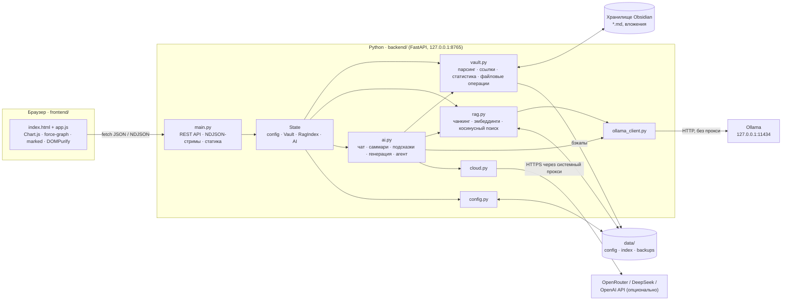
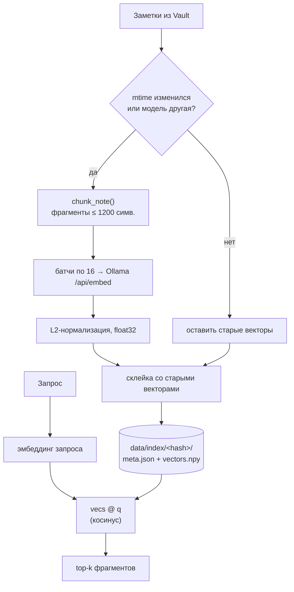
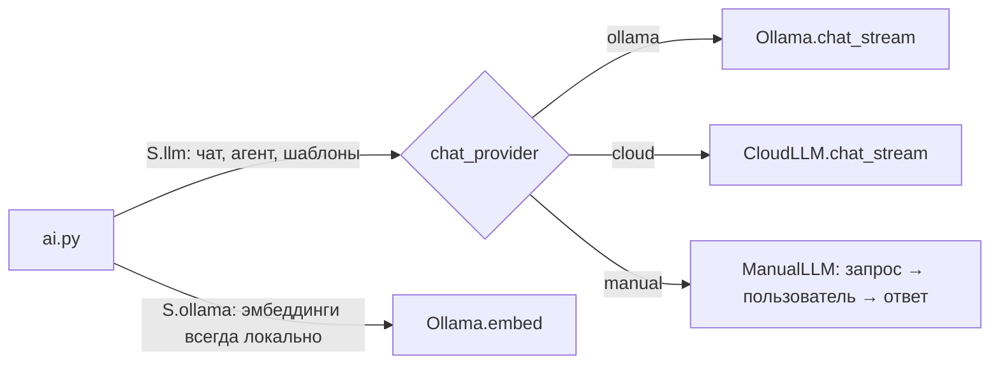
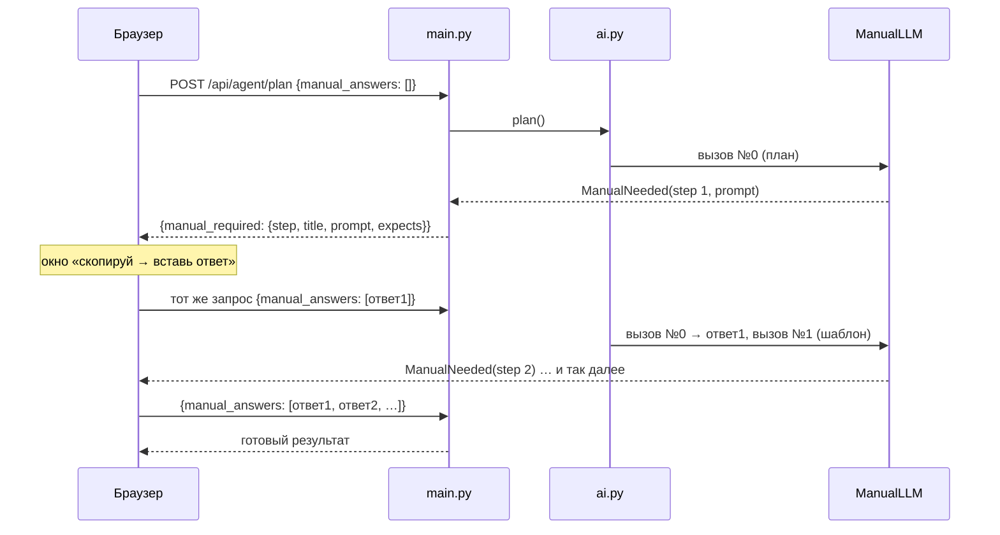
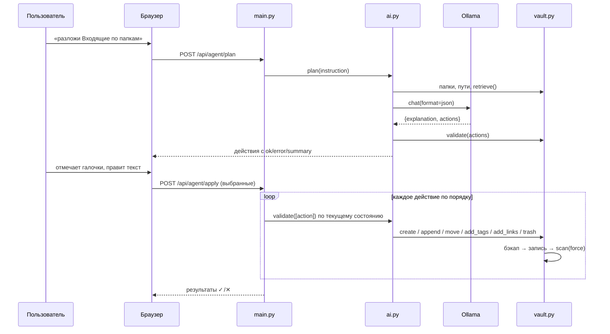

# Mnemo

> Твоё хранилище заметок, которое помнит за тебя.

[](LICENSE)
**[Живое демо](https://rabbau.github.io/Mnemo/demo/)** · [О проекте](https://rabbau.github.io/Mnemo/) · [GitHub](https://github.com/Rabbau/Mnemo)

Локальное веб-приложение для работы с хранилищем [Obsidian](https://obsidian.md): статистика, граф связей, чат с заметками и ИИ-агент, который наводит порядок в базе. ИИ по умолчанию работает локально через [Ollama](https://ollama.com), и заметки не покидают компьютер. По желанию чат-модель можно переключить на облачную: OpenRouter, DeepSeek, ChatGPT (OpenAI) или любой OpenAI-совместимый API. А без ключа и без своей модели работает бесплатный режим **«Веб-чат»**: приложение готовит запрос, ты вставляешь его в chat.deepseek.com или chatgpt.com и возвращаешь ответ.

- [Быстрый старт](#быстрый-старт)
- [Демо и GitHub Pages](#демо-и-github-pages)
- [Возможности](#возможности)
- [Архитектура](#архитектура)
  - [Общая схема](#общая-схема)
  - [Модули бэкенда](#модули-бэкенда)
  - [Модель хранилища](#модель-хранилища-vaultpy)
  - [Семантический индекс (RAG)](#семантический-индекс-ragpy)
  - [Шаблоны](#шаблоны-templatespy)
  - [ИИ-функции и агент](#ии-функции-и-агент-aipy)
  - [Фронтенд](#фронтенд)
  - [Потоковые ответы](#протокол-потоковых-ответов)
- [HTTP API](#http-api)
- [Данные на диске](#данные-на-диске)
- [Безопасность](#безопасность)
- [Настройки](#настройки)
- [Как расширять](#как-расширять)
- [Решение проблем](#решение-проблем)
- [Ограничения](#ограничения)
- [Лицензия](#лицензия)

---

## Быстрый старт

**Нужно:** Python 3.10+. Ollama нужна только для ИИ-функций: статистика, граф и заметки работают без неё.

### Скачать

```bash
git clone https://github.com/Rabbau/Mnemo.git
cd Mnemo
```

Или **Code → Download ZIP** на [странице репозитория](https://github.com/Rabbau/Mnemo).

### Windows

Двойной клик по `run.bat`. При первом запуске он создаст виртуальное окружение `.venv`, поставит зависимости и откроет http://127.0.0.1:8765.

### Вручную (любая ОС)

```bash
python -m venv .venv
.venv/Scripts/pip install -r requirements.txt      # Linux/macOS: .venv/bin/pip
.venv/Scripts/python -m uvicorn backend.main:app --host 127.0.0.1 --port 8765
```

На Linux/macOS можно просто запустить `./run.sh`.

### Первое подключение

1. Открой **Настройки**. Приложение читает список хранилищ из конфига самого Obsidian и показывает их кнопками. Можно и вписать путь вручную.
2. Для пробы есть `demo-vault/`: около 40 заметок начинающего бэкенд-разработчика с папками-номерами, шаблонами Templater, MOC-хабами, сиротой и ссылками на несуществующие заметки.

### Подключение ИИ

```bash
# 1. установи Ollama: https://ollama.com/download
ollama pull qwen2.5:7b          # чат-модель (хорошо знает русский; для слабого ПК — qwen2.5:3b)
ollama pull nomic-embed-text    # эмбеддинги для поиска по смыслу (для русского точнее bge-m3)
```

Затем в **Настройках** нажми «Проверить», выбери модели и нажми «Обновить индекс».

### Облачная модель (OpenRouter, DeepSeek, ChatGPT)

Если локальная модель слабовата или медленная, чат, агент и заполнение шаблонов можно перевести на облачную модель:

1. Получи API-ключ: [OpenRouter](https://openrouter.ai/keys) (сотни моделей по одному ключу, есть бесплатные), [DeepSeek](https://platform.deepseek.com/api_keys) или [OpenAI](https://platform.openai.com/api-keys).
2. **Настройки → Модель для чата → Облачная (API)**: выбери провайдера, вставь ключ, нажми «Сохранить и проверить».
3. Выбери модель из появившегося списка. Для OpenRouter есть фильтр «только бесплатные».

Поиск по смыслу (индекс) при этом остаётся на локальной Ollama: эмбеддинги бесплатны и не требуют интернета.

### Бесплатно: режим «Веб-чат» (без ключа и без своей модели)

**Настройки → Модель для чата → Веб-чат (бесплатно).** Когда приложению нужен ИИ, открывается окно:

1. **Скопировать** — готовый запрос со всей инструкцией и найденными фрагментами заметок.
2. Вставить его в [chat.deepseek.com](https://chat.deepseek.com/), [chatgpt.com](https://chatgpt.com/) или любой другой чат.
3. Скопировать ответ **кнопкой копирования под ответом** (так сохраняется markdown) и вставить обратно → **Продолжить**.

Работают все функции. Простые (чат, быстрый ответ, «Кратко», подсказки, генерация) — за 1 шаг. Агент — за 1 шаг плюс по шагу на каждую заметку по шаблону, такие шаги можно **пропустить**, тогда останется пустой шаблон. JSON находится, даже если чат обернул его в текст или в блок ```` ```json ````. Без Ollama поиск по заметкам идёт по словам.

> **Приватность:** в облачном режиме провайдеру отправляются вопрос и найденные фрагменты заметок (обычно 4–8 кусков до 1500 символов), а у агента — ещё и список путей заметок. Всё хранилище целиком никуда не уходит.

---

## Демо и GitHub Pages

В `docs/` лежит сайт проекта для GitHub Pages:

| Путь | Что это |
|---|---|
| `docs/index.html` | Лендинг: возможности, режимы ИИ, установка и встроенное живое демо |
| `docs/demo/` | **Настоящий интерфейс Mnemo**, работающий без сервера на примере `demo-vault`. Статистика, граф, заметки, поиск, шаблоны и навигация работают по-настоящему, ответы ИИ заменены заготовками из найденных заметок, изменения не сохраняются |

Как устроено демо: `scripts/build_demo.py` снимает снимок `demo-vault` через тот же бэкенд (статистика, граф, заметки, шаблоны) в `docs/demo/data.js` и копирует фронтенд. Файл `docs/demo/demo-api.js` подменяет `fetch("/api/…")` в браузере и отвечает из снимка, поэтому код приложения для демо не меняется.

**Опубликовать:**
1. Запушь репозиторий на GitHub.
2. **Settings → Pages → Build and deployment**: Source — *Deploy from a branch*, Branch — `main`, папка — **`/docs`** → Save.
3. Через минуту сайт появится на `https://<ник>.github.io/<репозиторий>/`, демо — на `…/demo/`.
4. Сайт: https://rabbau.github.io/Mnemo/, демо: https://rabbau.github.io/Mnemo/demo/. Адрес репозитория для ссылок на лендинге задан в `docs/index.html` (константа `REPO_URL` внизу страницы).

**Обновить демо** после изменений во фронтенде или в демо-хранилище:

```bash
python scripts/make_demo_vault.py   # пересоздать demo-vault (если менял его содержимое в скрипте)
python scripts/build_demo.py        # пересобрать docs/demo
```

---

## Возможности

| Раздел | Что делает |
|---|---|
| **Найти / спросить** (Ctrl+K) | Доступно из любого раздела. Пишешь, что ищешь, и сразу видишь подходящие заметки (поиск по смыслу и по словам). Enter открывает заметку, Ctrl+Enter — короткий ответ ИИ вида «это в заметке [[X]]» со списком источников |
| **Обзор** | Показатели: заметки, слова, связи, теги, сироты, битые ссылки, вложения, кластеры. Графики по папкам и тегам, тепловая карта активности за год (изменение или создание), рост базы по месяцам. Блок «здоровье связей». Топы: хабы, самые цитируемые, самые большие заметки. Списки сирот, битых ссылок и ссылок на несуществующие заметки (по клику создаётся заметка). Сортируемая таблица всех папок |
| **Граф** | Интерактивный force-directed граф. Цвет узла зависит от папки верхнего уровня, размер от числа связей. При наведении подсвечиваются соседи. Есть поиск, фильтры по папке и сиротам, карточка заметки |
| **Заметки** | Кнопка «+ Новая» создаёт заметку по шаблону: шаблон подбирается по папке, есть превью. Полнотекстовый поиск с ранжированием, фильтр по папке, сортировки. Просмотр markdown с рабочими `[[вики-ссылками]]` и картинками, редактор (Ctrl+S), перемещение и переименование с обновлением ссылок, кнопка «Открыть в Obsidian». ИИ: краткое содержание, подсказки тегов, связей и папки, похожие заметки |
| **Чат** | Вопросы к базе знаний (RAG) с потоковым ответом и списком заметок-источников. Можно ограничить поиск одной папкой |
| **ИИ-агент** | Задание на естественном языке превращается в план действий. Новые заметки агент создаёт **по твоим шаблонам** и кладёт в папку шаблона. Предупреждает, если похожая заметка уже есть. Ты отмечаешь нужные действия (текст можно поправить) и применяешь их. Ещё генерация новой заметки (с шаблоном или без) и сводка по папке |
| **Настройки** | Хранилище, адрес Ollama, модели, температура, размер контекста, управление индексом |

---

## Архитектура

### Общая схема



Принципы:

- **Один процесс, без базы данных.** Состояние хранилища живёт в памяти и пересобирается инкрементально по `mtime`. На диск пишутся только настройки, векторный индекс и бэкапы.
- **Хранилище — единственный источник правды.** Приложение не кеширует содержимое в своём формате: всё, что изменил Obsidian, подхватится при следующем скане.
- **Никакой сборки фронтенда.** Обычные HTML, CSS и JS, библиотеки лежат в `frontend/vendor/`, так что приложение работает офлайн.
- **ИИ опционален.** Без Ollama поиск для чата откатывается на поиск по словам, а без индекса «похожие заметки» ищутся по ключевым словам.

### Модули бэкенда

| Файл | Ответственность |
|---|---|
| `main.py` | FastAPI-приложение. Глобальный объект `State` (конфиг, текущий `Vault`, `RagIndex`, фоновая задача индексации, `AI`), все HTTP-эндпоинты, раздача `frontend/`, обёртка `ndjson()` для потоковых ответов |
| `config.py` | Чтение и запись `data/config.json` со значениями по умолчанию. Поиск хранилищ в `obsidian.json` (Windows: `%APPDATA%/obsidian`, macOS: `~/Library/Application Support/obsidian`, Linux: `~/.config/obsidian`) |
| `vault.py` | Модель хранилища: класс `Note`, класс `Vault` (скан, разрешение ссылок, граф, поиск, статистика) и все операции записи |
| `rag.py` | `RagIndex`: разбиение заметок на фрагменты, эмбеддинги через Ollama, хранение в numpy, поиск и «похожие заметки» |
| `templates.py` | Шаблоны Obsidian: поиск папки шаблонов и соответствий «папка → шаблон» (Templater / core Templates), подсказки «когда использовать», рендер `<% tp.* %>` и `{{date}}`, сборка ответа модели по скелету шаблона |
| `ai.py` | Класс `AI`: гибридный поиск, быстрые ответы, промпты и логика чата, саммари, подсказок, генерации по шаблонам, планирования, проверки и применения действий агента |
| `ollama_client.py` | Тонкий асинхронный клиент Ollama на `httpx`: `version`, `models`, `chat_stream`, `chat`, `embed`. Сетевые ошибки превращает в `OllamaError` с понятным текстом. Всегда ходит на `127.0.0.1` и мимо системного прокси |
| `cloud.py` | `CloudLLM`: клиент OpenAI-совместимых API (`/models`, `/chat/completions` со стримингом SSE) с тем же интерфейсом `chat_stream`/`chat`/`models`, что у Ollama. Пресеты OpenRouter, DeepSeek, OpenAI и свой адрес |

Зависимости между модулями идут в одну сторону: `main → ai → (rag, templates, vault, ollama_client | cloud)`, `rag → (vault, ollama_client)`, `templates → vault`. Модуль `vault.py` ничего не знает про ИИ.

### Модель хранилища (`vault.py`)

#### Скан

`Vault.scan()` обходит хранилище через `os.walk`:

- пропускает папки, чьё имя начинается с `.` (`.obsidian`, `.trash`, `.git`, `.smart-env`…), `node_modules` и **папку шаблонов** (шаблоны не заметки: не должны попадать в статистику, граф и поиск);
- `*.excalidraw.md` считаются вложениями, а не заметками;
- `*.md` становятся заметками, остальные файлы — вложениями;
- **инкрементальность:** заметка перепарсивается, только если изменились `mtime` или размер, удалённые файлы выкидываются;
- **троттлинг:** повторный скан раньше чем через 3 секунды пропускается (`force=True` его форсирует, так делают все операции записи).

Для 170 реальных заметок полный скан занимает около 0,3 с, повторный — миллисекунды.

#### Парсинг заметки

| Что | Как |
|---|---|
| Frontmatter | YAML между `---` в начале файла (используется `CSafeLoader`, если доступен). Ошибки YAML не роняют парсинг |
| Теги | `tags`/`tag` из frontmatter (список или строка) плюс `#теги` в тексте. Код-блоки и инлайн-код игнорируются. Тег приводится к нижнему регистру и должен содержать хотя бы один не-цифровой символ (как в Obsidian). Вложенные теги `a/b` сохраняются как есть |
| Ссылки | `[[target#anchor\|alias]]`, эмбеды `![[...]]`, вики-ссылки внутри frontmatter (свойства), markdown-ссылки `[text](path.md)` на локальные файлы |
| Слова | Регулярка `[\w'’-]+` по телу без frontmatter |
| Дата создания | Первое найденное из `created`, `date`, `created_at`, `creation_date`, `создано`, `дата`, иначе время создания файла (`st_birthtime` или `st_ctime` на Windows) |
| Заголовок | `title` из frontmatter или имя файла |

#### Разрешение ссылок

`Vault.resolve(target, src)` повторяет логику Obsidian:

1. Пустая цель (`[[#Заголовок]]`) означает ссылку на саму заметку.
2. Пути `./` и `../` считаются относительно папки заметки-источника.
3. Сначала ищется точное совпадение пути без `.md` (регистр не важен).
4. Затем поиск по имени файла. Если в цели есть `/`, остаются кандидаты, чей путь заканчивается на неё.
5. Если кандидатов несколько, выбирается заметка из той же папки, что источник, иначе самая мелко вложенная.

Если заметка не нашлась, пробуем найти вложение (`resolve_file`). Не нашлось и оно — ссылка попадает в `broken`. Итог сборки — индексы `out_edges`/`in_edges` (множества путей), список битых ссылок и счётчик ссылок на вложения.

#### Статистика

`Vault.stats()` считается на лету из индексов в памяти, без отдельного хранилища:

- **итоги:** заметки, слова, связи (уникальные рёбра заметка→заметка), теги, сироты (нет ни входящих, ни исходящих), заметки без входящих и без исходящих ссылок, пустые (< 5 слов), вложения;
- **папки:** рекурсивные суммы (заметки, слова, исходящие ссылки) для каждой папки плюс «прямо в папке»;
- **кластеры:** компоненты связности через union-find на неориентированном графе;
- **активность:** счётчики по дням для `mtime` и даты создания, для тепловой карты;
- **рост:** количество новых заметок по месяцам и накопительный итог;
- **топы:** хабы (вход + выход), цитируемые (вход), крупнейшие (слова), недавние.

#### Поиск по словам

`keyword_search()` работает без ИИ, и на нём держится весь фолбэк. Служебные слова вопросов («где», «писал», «про», «напомни»…) отбрасываются. Каждое слово запроса длиной от 3 символов обрезается на 2 символа (грубый стемминг: «заметки» найдёт «заметка»). Вес совпадения в заголовке — ×10, в тексте — до 20 совпадений, в теге — +5, полная фраза в заголовке — +30. К каждому результату прикладывается сниппет вокруг первого совпадения.

#### Операции записи

Все пути проходят через `safe_path()`: путь приводится к абсолютному и должен остаться внутри хранилища. Писать в служебные папки (начинающиеся с `.`) запрещено, кроме `.trash`. Перед каждой правкой существующего файла делается бэкап.

| Метод | Что делает |
|---|---|
| `create(path, content)` | Новая заметка. Недопустимые символы `\:*?"<>\|` заменяются на `-`, `.md` добавляется, существующий файл не перезаписывается |
| `save(path, content)` | Перезапись с бэкапом |
| `append(path, text)` | Дописать в конец с правильными переводами строк |
| `add_tags(path, tags)` | Добавить в `tags:` frontmatter только те теги, которых ещё нет (включая инлайн-теги). Если frontmatter нет, он создаётся. Стиль переводов строк (CRLF или LF) сохраняется |
| `add_links(path, targets)` | Дописать `- [[...]]` под заголовком «Связанные заметки», пропуская уже связанные заметки. Текст ссылки — короткое имя, если оно уникально, иначе путь |
| `move(path, new_path)` | Перемещение или переименование. **До** переноса переписываются все `[[ссылки]]` на заметку (включая ссылки внутри неё самой) с сохранением `#якоря` и `\|алиаса` |
| `create_folder(path)` | Создать папку |
| `trash(path)` | Перенести в `.trash/` хранилища (при совпадении имени добавляется суффикс ` (1)`) |

### Семантический индекс (`rag.py`)



- **Чанкинг.** Текст делится по заголовкам `#`, затем по абзацам. Абзацы набираются в фрагмент до 1200 символов, слишком длинные режутся. К каждому фрагменту добавляется шапка: заголовок, папка и теги заметки. Так даже фрагмент из середины заметки «знает», откуда он. Пустая заметка получает один фрагмент из шапки, чтобы находиться по названию.
- **Префиксы.** Для `nomic-embed-text` добавляются `search_document:` и `search_query:`, как рекомендует модель.
- **Инкрементальность.** В `meta.notes` хранится `mtime` каждой заметки на момент индексации. Переиндексируются только изменённые и новые заметки, удалённые выбрасываются. Смена модели эмбеддингов вызывает полное пересоздание.
- **Атомарность.** Новый индекс собирается в локальных переменных и заменяет старый только после успешного завершения. Ошибка посередине (например, упала Ollama) не портит существующий индекс.
- **Фоновый режим.** Индексация запускается как `asyncio.Task`, UI раз в секунду опрашивает `/api/index/status` (прогресс `done/total`).
- **Поиск.** Матричное умножение `vecs @ q`. Фильтр по папке — маска по пути. Для тысяч заметок этого хватает с запасом, отдельная векторная БД не нужна.
- **Похожие заметки.** Вектор заметки — среднее её фрагментов (кешируется после сборки индекса), дальше косинусная близость между заметками.
- **Хранение.** Для каждого хранилища своя папка `data/index/<sha1(путь)[:12]>/`.

### Шаблоны (`templates.py`)

**Где искать шаблоны.** Папка шаблонов берётся из `.obsidian/plugins/templater-obsidian/data.json` (`templates_folder`), затем из `.obsidian/templates.json` (core Templates), иначе ищется папка `template`/`templates`/`Шаблоны`. Соответствия «папка → шаблон» берутся из `folder_templates` Templater. Как и в самом Templater, для подпапки действует шаблон ближайшей настроенной родительской папки.

**Описание шаблона** (`GET /api/templates`): имя, путь, папка назначения, теги, список разделов (`##`) и подсказка — текст из комментария `/* КОГДА ИСПОЛЬЗОВАТЬ: … */` в первом блоке `<%* %>`. Если папка не задана в настройках, она берётся из строки «Клади в: …» в подсказке. Подсказки получает агент, чтобы выбирать шаблон по смыслу.

**Рендер** (без запуска JavaScript):

| Синтаксис | Результат |
|---|---|
| `<% tp.file.title %>` | название заметки |
| `<% tp.date.now("DD MMMM YYYY", offset) %>` | дата в формате moment.js, русская локаль («26 сентября 2026», но «сентябрь 2026») |
| `tp.date.tomorrow/yesterday`, `tp.file.creation_date`, `tp.file.folder` | поддерживаются |
| `<%* … %>` | блоки кода выбрасываются (в них только комментарии-подсказки) |
| `-%>`, `<%-`, `_%>` | управление пробелами, как в Templater |
| `{{title}}`, `{{date:FORMAT}}`, `{{time}}` | плейсхолдеры core Templates |

Всё остальное заменяется пустой строкой и попадает в `warnings`.

**Заполнение шаблона моделью.** Модели передаётся отрендеренный скелет, подсказка шаблона, запрос и найденные заметки. Ответ **собирается заново по скелету** (`assemble_from_skeleton`): frontmatter и `# заголовок` берутся из шаблона (даты и теги всегда верные), затем идут разделы `##` в порядке шаблона с содержимым из ответа модели (заголовки сравниваются без эмодзи, по основам слов). Разделы, которых нет в шаблоне, выбрасываются, пропущенные остаются с подсказками шаблона. До этого с конца ответа срезается «убежавший» текст: вторая заметка или повтор контекста. Так даже маленькая модель не может сломать структуру шаблона.

### Провайдеры моделей



`State.llm` возвращает клиента активного провайдера, `State.ollama` всегда локальную Ollama для индекса. Оба клиента реализуют один интерфейс, поэтому `ai.py` не знает, с кем работает. Отличаются детали:

| | Ollama | CloudLLM |
|---|---|---|
| Протокол | `/api/chat`, NDJSON | `/chat/completions`, SSE (`data: …`, `[DONE]`). Комментарии `: OPENROUTER PROCESSING` и `reasoning_content` моделей-«думалок» пропускаются |
| JSON-режим | `format: "json"` | `response_format: {"type": "json_object"}`. Если модель его не поддерживает (400), запрос повторяется без него |
| Параметры | `temperature`, `num_ctx` | только `temperature` |
| Прокси | никогда (локальный сервис) | системный `HTTP(S)_PROXY` |
| Ошибки | `OllamaError` | `CloudError` (подкласс `OllamaError`) с расшифровкой 401/402/403/404/429 |

#### Режим «Веб-чат» (`manual.py`): повтор запроса с ответами

Модель здесь — человек с веб-чатом, поэтому вызов нельзя «подождать» внутри запроса. Вместо этого используется **повтор (replay)**:



- `start_session(answers)` кладёт ответы в `contextvar` запроса. `ManualLLM` отдаёт i-й ответ на i-й вызов модели, а на первом отсутствующем бросает `ManualNeeded` с текстом запроса (system, история и запрос склеены в один промпт с разделами `=== ИНСТРУКЦИЯ ===` / `=== ЗАПРОС ===`).
- Поиск контекста детерминирован, поэтому при повторе запрос проходит тот же путь и доходит до следующего вызова.
- Для потоковых эндпоинтов вместо HTTP-ответа отдаётся событие `{"type": "manual", …}`, для JSON-эндпоинтов — `{"manual_required": …}`. На клиенте это обрабатывают общие `api()` и `stream()`: в местах вызова ничего не меняется, поэтому режим работает во всех функциях сразу.
- Шаги заполнения шаблонов помечены `skippable`: пустой ответ даёт незаполненный шаблон.

**Ключи API** хранятся в `data/config.json` отдельно для каждого пресета (`cloud.<preset>.api_key`), поэтому при переключении OpenRouter ↔ DeepSeek ключи не теряются. `GET /api/config` никогда не отдаёт ключ целиком, только `has_key` и последние 4 символа. Пустой ключ при сохранении означает «оставить прежний», для удаления есть отдельная кнопка (`clear_api_key`).

### ИИ-функции и агент (`ai.py`)

#### Извлечение контекста (гибридный поиск)

`AI.retrieve(query)` — общая точка для чата, быстрых ответов, генерации и агента. Если индекс готов, семантический поиск и поиск по словам запускаются вместе, а заметки ранжируются через **reciprocal rank fusion**: `score = Σ 1/(60 + rank)` по обоим спискам. Так находятся и заметки «по смыслу», и точные термины вроде `APScheduler`. От каждой заметки берётся до 2 лучших фрагментов. Без индекса остаётся поиск по словам. Метод (`hybrid`, `semantic` или `keyword`) возвращается клиенту. В контекст для модели попадают даты создания и изменения заметок, чтобы она могла ответить на вопрос «когда я это писал».

`AI.search(query)` — то же ранжирование на уровне заметок со сниппетами, для палитры Ctrl+K. Работает без чат-модели, нужен только эмбеддинг запроса (около 0,1 с).

#### Сценарии

| Функция | Вход для модели | Формат ответа |
|---|---|---|
| **Чат** | system-промпт с фрагментами (`### Заметка [[Название]] (путь, даты)`) + вся история диалога | стрим markdown, модель ставит `[[ссылки]]` на источники |
| **Быстрый ответ** (Ctrl+K) | вопрос + фрагменты, температура 0.2, инструкция «кратко и только по заметкам» | стрим, 1–4 предложения со ссылкой на заметку |
| **Кратко** (заметка) | текст до 14 000 символов | стрим markdown |
| **Сводка по папке** | заметки папки (сначала свежие) с бюджетом около 14 000 символов, поровну на заметку | стрим markdown |
| **Генерация** | запрос + (опционально) найденные фрагменты + (опционально) скелет шаблона | стрим markdown, в конце событие `final` с заметкой, собранной по шаблону |
| **Подсказки** | заметка + 150 популярных тегов + папки + кандидаты для ссылок | JSON `{tags, folder, links, reason}` |
| **План агента** | папки + шаблоны с подсказками + несуществующие заметки, на которые есть ссылки + до 200 путей заметок (с приоритетом папок из запроса) + 6 релевантных фрагментов | JSON `{explanation, actions[]}`, затем отдельный вызов на заполнение каждого шаблона |

Для JSON-ответов используется режим Ollama `format: "json"` и температура 0.2. `extract_json()` дополнительно выковыривает объект из ответа, если модель обернула его в ```` ``` ```` или текст.

**Кандидаты для ссылок** в подсказках берутся из семантически похожих заметок (или из поиска по словам). Заметки, на которые ссылка уже есть, исключаются. Ответ модели проверяется: ссылки остаются только на заметки из списка кандидатов, теги нормализуются, теги, которые уже стоят, отбрасываются, текущая папка не предлагается.

#### Жизненный цикл агента



Два уровня проверки:

1. **После планирования.** `validate()` нормализует пути, ищет существующие заметки (точный путь, путь в любом регистре или имя), проверяет, что цель перемещения свободна, а заметки для `add_links` существуют. Невалидные действия показываются в UI отключёнными, с причиной.
2. **Перед каждым применением.** Действие проверяется ещё раз по актуальному состоянию хранилища. Поэтому цепочки вида «создать папку → переместить в неё» или «создать заметку → поставить на неё ссылку» работают, а конфликт, возникший после планирования, будет пойман.

Типы действий: `create`, `create_folder`, `append`, `move`, `add_tags`, `add_links`, `trash`. Физического удаления нет вовсе.

**Шаблоны в агенте.** У действия `create` есть поле `template`. В нём модель указывает шаблон, а в `content` пишет только короткое ТЗ. Если модель шаблон не указала, но создаёт заметку в папке, у которой он есть, шаблон применяется автоматически, как это сделал бы Templater. Заметка без папки кладётся в папку шаблона. Затем для каждой такой заметки (до 6 за план) отдельный вызов модели заполняет шаблон, и пользователь видит в плане готовый текст. Если такая заметка уже есть (одно название содержит другое), действие помечается предупреждением.

### Фронтенд

Одностраничное приложение без фреймворка и сборки: `index.html` (разметка всех разделов), `style.css` (тёмная тема на CSS-переменных), `app.js`.

Устройство `app.js`:

- **Глобальное состояние `S`:** конфиг, статистика, граф, открытая заметка, история чата, флаги «раздел загружен».
- **Роутинг:** `showView(name)` переключает `<section>`, лениво вызывает загрузчик раздела и запоминает последний раздел в `localStorage`. Без подключённого хранилища всегда открываются настройки.
- **Хелперы:** `api()` (JSON-запросы с разбором `detail` ошибок FastAPI), `stream()` (чтение NDJSON), `busy()` (спиннер на кнопке и тост с ошибкой), `modal()`, `toast()`.
- **Markdown:** `renderMarkdown()` сначала превращает `[[вики-ссылки]]` в `<a class="wikilink">`, а `![[картинки]]` в ``, потом рендерит через `marked` и чистит через `DOMPurify`. Клики по вики-ссылкам ловит один делегированный обработчик: он разрешает цель через `/api/resolve` и открывает заметку. Любой элемент с `data-open="путь"` тоже открывает заметку.
- **Инвалидация:** после любой записи `reloadAfterChange()` сбрасывает кеш статистики и графа и перечитывает список папок и заметок.
- **Библиотеки** (`frontend/vendor/`): Chart.js 4 (графики), force-graph (граф на canvas), marked (markdown), DOMPurify (санитизация).

### Протокол потоковых ответов

Чат, «Кратко», генерация и сводка отвечают в формате `application/x-ndjson`: одно JSON-событие на строку.

```
{"type": "sources", "method": "semantic", "sources": [{"path": "...", "title": "...", "score": 0.81}]}
{"type": "model", "model": "qwen2.5:7b"}
{"type": "token", "content": "Кусок "}
{"type": "token", "content": "ответа"}
{"type": "done"}
```

Если ошибка случилась уже после начала стрима, HTTP-статус изменить нельзя. Поэтому `ndjson()` ловит исключение и отправляет `{"type": "error", "message": "..."}`, а клиент превращает его в исключение. Отмена (кнопка «Стоп» в чате) делается через `AbortController`.

---

## HTTP API

Все эндпоинты под `/api`. Ошибки приходят как `{"detail": "текст"}` с кодом 4xx или 5xx (502 — проблема с Ollama, 422 — модель вернула некорректный JSON).

| Метод | Путь | Назначение |
|---|---|---|
| GET | `/config` | Текущие настройки + `vault_ok`, `vault_name` |
| POST | `/config` | Частичное обновление настроек. Смена `vault_path` открывает новое хранилище |
| GET | `/vaults/detected` | Хранилища из конфига Obsidian |
| GET | `/stats?refresh=1` | Полная статистика |
| GET | `/graph` | `{nodes, links}` для графа |
| GET | `/folders` | Все папки |
| GET | `/notes?q=&folder=` | Список заметок. С `q` — поиск по словам со сниппетами |
| GET | `/note?path=` | Заметка: текст, теги, обратные, исходящие и битые ссылки |
| GET | `/resolve?target=&src=` | Разрешить `[[цель]]` в путь |
| GET | `/attachment?target=&src=` | Отдать файл-вложение |
| POST | `/note/save` · `/note/create` · `/note/move` | Запись, создание, перемещение |
| GET | `/ollama/status` | Версия и модели (с флагом `embedding`) |
| GET | `/llm/status` | Состояние активной чат-модели: провайдер, модель, список моделей (для OpenRouter с флагом `free`), ошибка |
| GET | `/index/status` · POST `/index/build` | Состояние индекса и запуск индексации (`{"full": true}` — пересоздать с нуля) |
| POST | `/chat` | Стрим. `{messages, use_rag, folder}` |
| POST | `/ai/summarize` | Стрим. `{path}` или `{folder}` |
| — | *любой ИИ-эндпоинт* | Принимает `manual_answers: [...]` для режима «Веб-чат» |
| POST | `/ai/generate` | Стрим. `{prompt, use_context, template ("" / "auto" / имя), title, folder}` |
| GET | `/search?q=&k=` | Гибридный поиск заметок со сниппетами (палитра Ctrl+K) |
| POST | `/ask` | Стрим. `{question}` → короткий ответ по заметкам |
| GET | `/templates` | Шаблоны: папка, соответствия папок, список с подсказками и разделами |
| POST | `/templates/render` | `{title, folder, template}` → отрендеренный текст (превью) |
| POST | `/note/from-template` | Создать заметку по шаблону без ИИ |
| POST | `/ai/suggest` | Подсказки тегов, ссылок и папки для `{path}` |
| GET | `/ai/similar?path=` | Похожие заметки |
| POST | `/ai/apply-suggestions` | `{path, tags, links, folder}` |
| POST | `/agent/plan` | `{instruction}` → проверенный план |
| POST | `/agent/apply` | `{actions}` → результаты по каждому действию |

Интерактивная документация FastAPI доступна на http://127.0.0.1:8765/docs.

---

## Данные на диске

```
mnemo/
├── backend/                 серверный код
├── frontend/                интерфейс (+ vendor/ с библиотеками)
├── demo-vault/              демо-хранилище (генерируется scripts/make_demo_vault.py)
├── docs/                    GitHub Pages: index.html (лендинг) и demo/ (интерфейс без сервера)
├── scripts/                 генерация демо-хранилища и сборка демо
├── data/                    создаётся автоматически, в .gitignore
│   ├── config.json          настройки
│   ├── index/<hash>/        векторный индекс хранилища
│   │   ├── meta.json        модель, mtime заметок, тексты фрагментов
│   │   └── vectors.npy      матрица эмбеддингов (N × dim, float32)
│   └── backups/<vault>/<YYYYmmdd-HHMMSS-us>/<путь заметки>
├── requirements.txt
├── run.bat / run.sh
├── LICENSE                  MIT
├── THIRD_PARTY_NOTICES.md   лицензии библиотек из frontend/vendor
└── README.md
```

В само хранилище приложение пишет только заметки (и `.trash/` при удалении). Служебных файлов рядом с заметками не появляется.

---

## Безопасность

- В облачном режиме провайдеру уходят только вопрос и найденные фрагменты заметок, а не хранилище целиком. Для полной приватности используй локальную модель.
- Сервер слушает только `127.0.0.1`, наружу он не виден.
- Все пути проверяются `safe_path()`: выйти за пределы хранилища (`../`) или писать в `.obsidian` нельзя.
- Любое изменение существующего файла сначала копируется в `data/backups/` с меткой времени. Откатиться можно, просто скопировав файл обратно.
- Агент только предлагает. Применяется лишь то, что отметил пользователь, и каждое действие перепроверяется перед выполнением.
- Удаление мягкое: заметка перемещается в `.trash/`, как делает сам Obsidian.
- HTML из заметок и ответов модели проходит через DOMPurify.

---

## Настройки

`data/config.json` (правится через UI):

| Ключ | По умолчанию | Описание |
|---|---|---|
| `vault_path` | — | Абсолютный путь к хранилищу |
| `ollama_url` | `http://localhost:11434` | Адрес Ollama. Может быть и другой машиной в сети |
| `chat_model` | пусто | Пусто — первая доступная чат-модель |
| `embed_model` | `nomic-embed-text` | Модель эмбеддингов. Смена вызывает пересоздание индекса |
| `temperature` | `0.4` | Для чата и генерации. Для JSON-задач всегда 0.2 |
| `context_chunks` | `6` | Сколько фрагментов заметок подкладывать в чат |
| `chat_provider` | `ollama` | `ollama` — локальная чат-модель, `cloud` — облачный API, `manual` — веб-чат (копировать и вставлять) |
| `cloud_preset` | `openrouter` | `openrouter`, `deepseek`, `openai` или `custom` |
| `cloud.<preset>` | — | `{base_url, api_key, model}` для каждого пресета |
| `context_length` | `8192` | Размер контекста модели (`num_ctx`). 8k помещает 7B-модель в 6 ГБ видеопамяти, больше — часть модели уйдёт в RAM и всё замедлится |

---

## Как расширять

**Новая метрика в статистике.** Посчитай её в `Vault.stats()` (все индексы уже в памяти) и выведи в `renderDashboard()` в `app.js`: новый KPI в массив `kpis` или карточку через `listInto()`.

**Новое действие агента:**
1. операция в `Vault` (с `_backup()` перед записью и `scan(force=True)` после);
2. описание действия в `AI.AGENT_SYSTEM`;
3. ветка проверки в `AI.validate()` (заполнить `summary`, при ошибке — `ValueError`);
4. ветка в `AI.apply()`;
5. подпись в `ACTION_LABELS` в `app.js` (и цвет `.action-type.<тип>` в CSS).

**Новая ИИ-функция со стримом.** Асинхронный генератор в `AI`, который отдаёт `{"type": "token", ...}`, эндпоинт `return ndjson(S.ai.my_feature(...))` и на клиенте `stream("/api/...", body, onEvent)`.

**Другой LLM-провайдер.** Реализуй тот же интерфейс, что у `Ollama` (`models`, `chat_stream`, `chat`, `embed`), и подставь его в `State.ollama`.

**Разработка.** Сервер с автоперезагрузкой бэкенда:

```bash
.venv/Scripts/python -m uvicorn backend.main:app --port 8765 --reload --reload-dir backend
```

Изменения фронтенда видны после обновления страницы.

---

## Решение проблем

| Симптом | Причина и решение |
|---|---|
| «Не удалось подключиться к Ollama» | Ollama не запущена или указан другой адрес. Проверь: `ollama list` |
| «model … not found» | Модель не скачана: `ollama pull <имя>` |
| «Модель вернула ответ не в формате JSON» | Маленькие модели путаются в структурированном выводе. Повтори или возьми модель на 7B+ |
| Ответы чата не по теме | Построй или обнови индекс. Для русского текста попробуй `bge-m3` |
| Статистика не видит новые заметки | Нажми «Обновить» на обзоре: скан троттлится до одного раза в 3 секунды |
| Агент долго думает | Составление плана и заполнение каждого шаблона — отдельные вызовы модели. На 7B-модели и GTX 1060 план с двумя заметками по шаблонам занимает 1–4 минуты |
| Настройки не видят модели, хотя `ollama run` работает | В пути к папке моделей Ollama есть `[` `]`. Перенеси модели в папку без квадратных скобок и поменяй Model location в настройках Ollama |
| Режим «Веб-чат»: заметка вставилась без форматирования | Копируй ответ кнопкой копирования под сообщением чата, а не выделением мышью: так сохраняется markdown |
| Режим «Веб-чат»: «Модель вернула ответ не в формате JSON» | Чат ответил текстом без JSON. Попроси его в том же диалоге «ответь только JSON» и вставь новый ответ |
| «Неверный или отозванный API-ключ» | Проверь ключ у провайдера. Если меняешь провайдера, ключ вводится отдельно для каждого |
| «Доступ запрещён… из твоего региона» (403) | OpenAI недоступен из некоторых стран. Облачные запросы идут через системный прокси (`HTTPS_PROXY`), так что включи VPN или прокси или используй OpenRouter или DeepSeek |
| «На счёте закончились деньги» (402) | Пополни баланс или выбери бесплатную модель (`:free` на OpenRouter) |
| Не удаётся подключиться к Ollama при включённом VPN или прокси | Приложение ходит в Ollama напрямую через `127.0.0.1`, минуя системный прокси. Проверь, что адрес в настройках — `http://127.0.0.1:11434` |

---

## Ограничения

- При перемещении обновляются только `[[вики-ссылки]]`. Markdown-ссылки `[текст](путь.md)` не переписываются.
- Алиасы из frontmatter не используются при разрешении ссылок (в Obsidian тоже).
- Изменение тегов пересохраняет frontmatter через YAML: содержимое сохраняется, но форматирование и комментарии в нём могут поменяться.
- Качество подсказок и планов агента целиком зависит от выбранной локальной модели.
- JavaScript внутри шаблонов Templater (`<%* … %>`, `tp.system.prompt`, пользовательские скрипты) не исполняется. Поддерживаются только дата, название и папка.
- Приложение рассчитано на одного пользователя: одновременная работа с нескольких вкладок не синхронизируется.

---

## Лицензия

[MIT](LICENSE): можно свободно использовать, изменять и распространять, в том числе в коммерческих проектах, сохраняя уведомление об авторских правах. Лицензии сторонних библиотек из `frontend/vendor/` — в [THIRD_PARTY_NOTICES.md](THIRD_PARTY_NOTICES.md).

«Obsidian» — товарный знак Dynalist Inc. Mnemo — независимый проект, он не связан с Obsidian и не одобрен его разработчиками.
